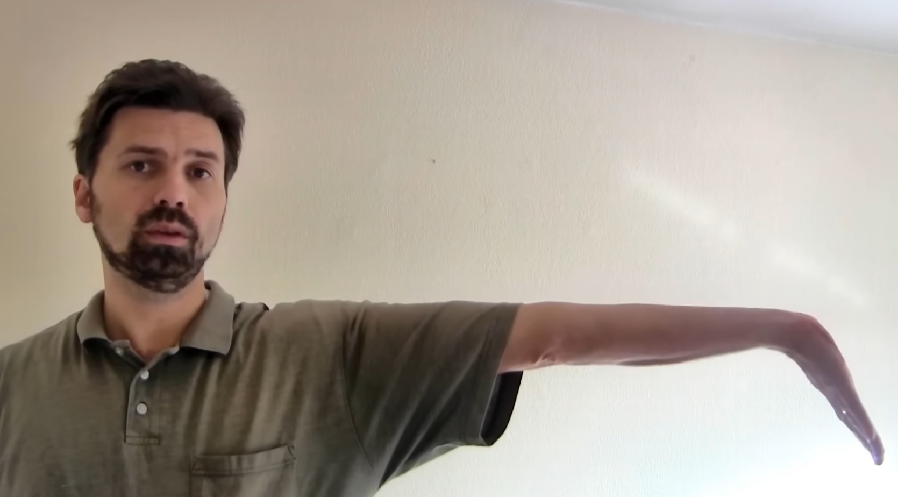
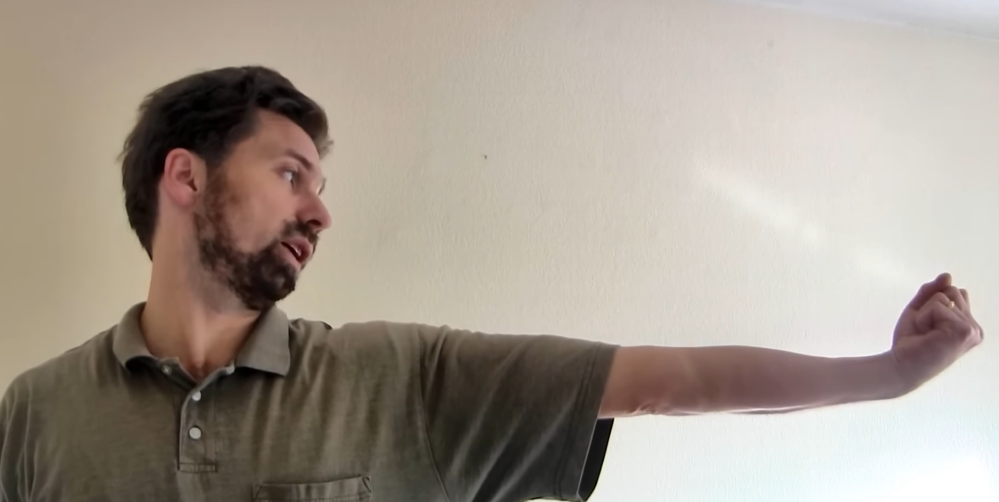
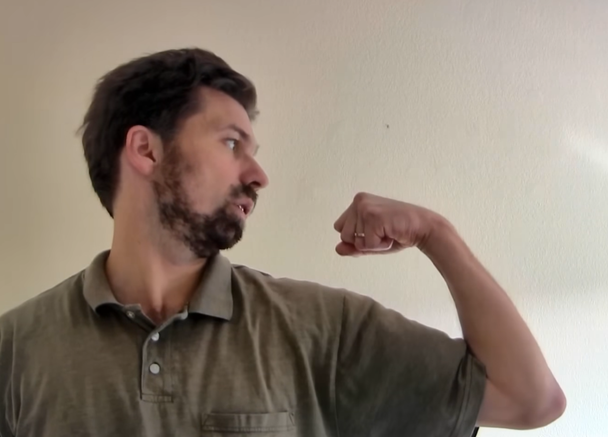
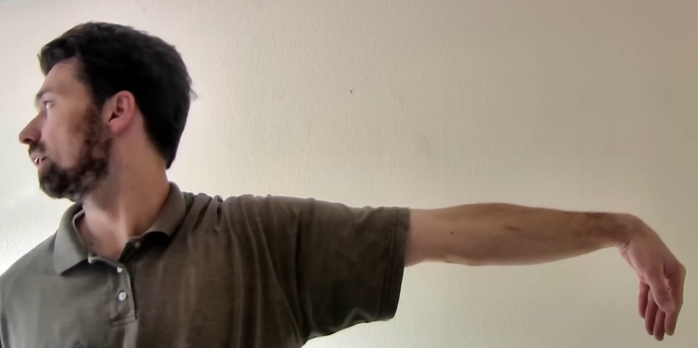
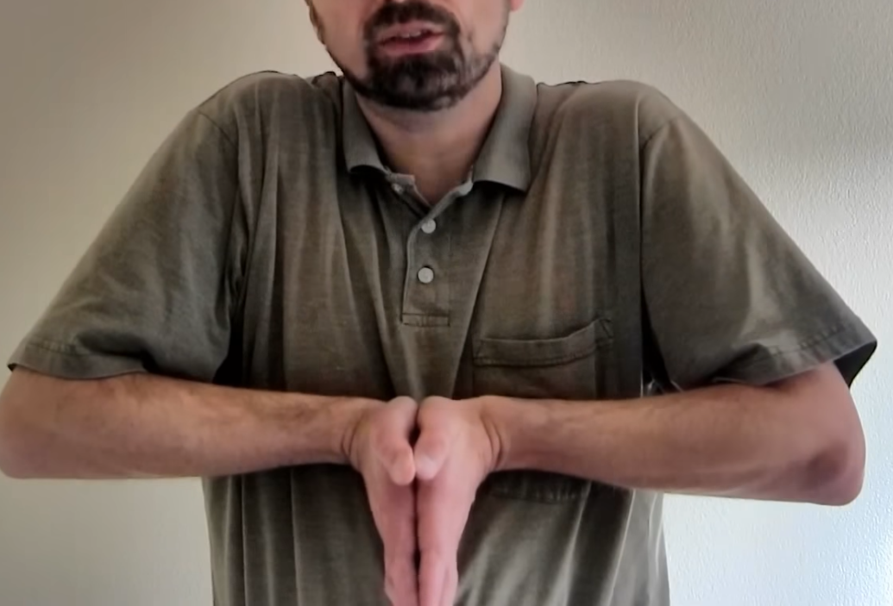
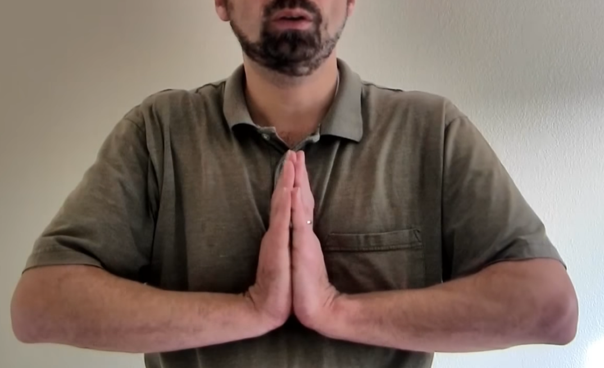
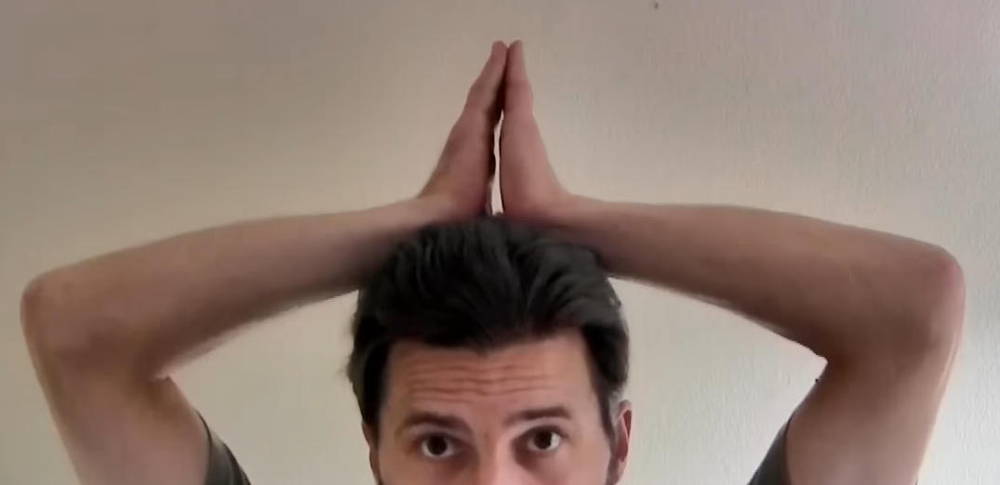
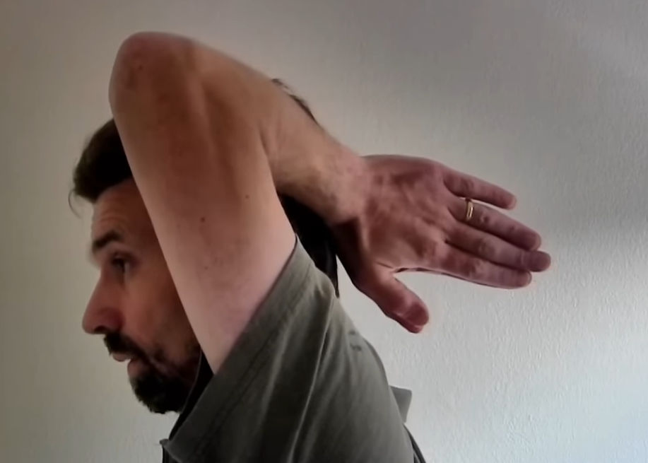
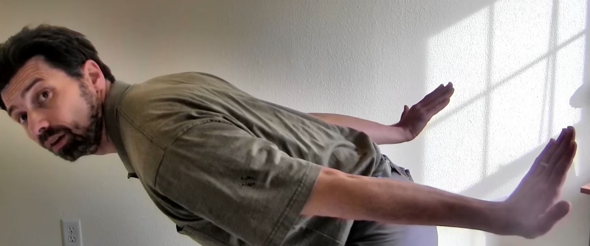

# Stretches for RSI

These Carpal tunnel (CPS) pain relief exercises were developed by Houshang Seradge, M.D. Images taken from [Wrist Exercises for Tendinitis Carpal Tunnel Syndrome - Avoid RSI injury in just 2 minutes a day! - YouTube](https://www.youtube.com/watch?v=fdD7CgN5FGg)

Do these gently and lightly, do not try to force anything. Each motion should be held for 10-15 seconds.

1. Arm outstretched to the side, hand down palm away

</img>

2. Arm outstretched to the side, upwards fist, look towards your fist

</img>

3. Arm to the side bent, look towards your fist

</img>

4. Arm outstretched to the side, hand down palm towards yourself, looking away

</img>

5. Hands together near the chest facing downwards, stretching upwards, keep shoulders relaxed

</img>

6. Hands together near the chest facing upwards, stretching downwards, keep shoulders relaxed

</img>

7. Same hand position as #6 but move hands overhead, keep shoulders relaxed and pointing outwards

</img>

8. Same hand position as #7 but with hands pointing behind

</img>

9. Bend over as far as you reasonably can, hands behind facing up, palms facing away

</img>
